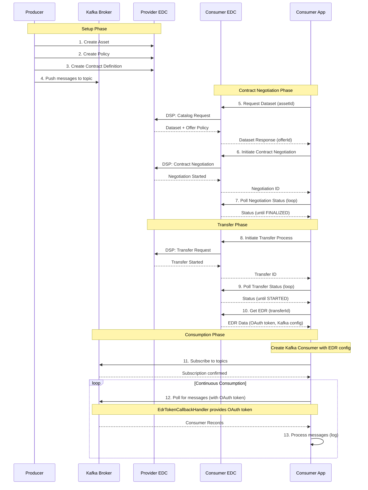

# Kafka Producer and Consumer Applications

## Overview

This directory contains example Kafka producer and consumer applications that demonstrate how to use the Tractus-X EDC
Kafka extension. These applications show how to set up a Kafka-based data exchange between a provider and a consumer
using the Eclipse Dataspace Connector (EDC) as the control plane.

## Building Blocks

### Kafka Producer Application

The Kafka producer application acts as a data provider in the EDC ecosystem. It publishes shopfloor information (production forecasts and tracking data) to Kafka topics and makes these data streams discoverable and accessible through EDC's dataspace protocol.

**Key Concepts:**

- **Configuration Management**: The application reads all settings from environment variables, allowing flexible deployment without code changes. This includes Kafka connection details, OAuth credentials, topic names, and EDC endpoints.

- **EDC Integration**: On startup, the application registers data assets with the EDC control plane. Each Kafka topic is represented as a separate asset with associated access policies and contract definitions, enabling governed access to the data streams.

- **Secure Messaging**: Uses OAuth bearer token authentication to securely connect to Kafka brokers. All communication can be encrypted using SSL/TLS.

- **Message Production**: Continuously generates and publishes messages to multiple topics in an alternating pattern. Messages follow Tractus-X semantic standards for shopfloor information exchange:
  - **Production Forecasts** ([`GetProductionForecast`](https://github.com/eclipse-tractusx/sldt-semantic-models/blob/main/io.catenax.shopfloor_information.get_production_forecast/1.0.0/gen/GetProductionForecast.json)): Information about expected production schedules
  - **Production Tracking** ([`GetProductionTracking`](https://github.com/eclipse-tractusx/sldt-semantic-models/blob/main/io.catenax.shopfloor_information.get_production_tracking/1.0.0/gen/GetProductionTracking.json)): Real-time tracking of production processes

- **Data Quality**: All messages include standardized headers with Business Partner Numbers (BPN), correlation identifiers, and timestamps to ensure traceability and proper message routing in the dataspace.

### Kafka Consumer Application

The Kafka consumer application acts as a data consumer in the EDC ecosystem. It discovers available data streams, negotiates access through EDC contracts, and consumes messages from Kafka topics using temporary credentials provided by the data provider.

**Key Concepts:**

- **Operation Modes**: Supports two modes of operation:
  - **Legacy mode**: Automatically starts consuming data on application startup
  - **API mode**: Provides REST endpoints to trigger consumption on demand

- **EDC Contract Negotiation**: Follows the standard EDC protocol to gain access to data:
  - Discovers available datasets from the provider's catalog
  - Negotiates contracts based on offered policies
  - Initiates data transfer processes
  - Receives an Endpoint Data Reference (EDR) containing temporary access credentials

- **Dynamic Configuration**: All Kafka connection details (bootstrap servers, topics, security settings) and OAuth credentials are received dynamically through the EDR. This ensures consumers never need to know provider infrastructure details in advance.

- **Secure Access**: Uses OAuth bearer tokens provided by the data provider through EDR. Tokens are automatically refreshed to maintain continuous access during long-running consumption sessions.

- **Message Processing**: Continuously polls for messages from subscribed topics and processes them according to business logic. The application can consume from multiple topics simultaneously, supporting diverse data streams like production forecasts and tracking data.

## Runtime Views

### Producer Workflow

The producer application follows a straightforward initialization and execution flow:

1. **Startup & Configuration**: On startup, the application loads all configuration from environment variables, including Kafka broker addresses, OAuth credentials, topic names, and EDC endpoints.

2. **EDC Asset Registration**: The application registers its data streams with the EDC control plane by creating assets for each Kafka topic (forecast, tracking, and generic stream). Each asset is associated with access policies and contract definitions that govern how consumers can access the data.

3. **Kafka Connection**: The application establishes a secure connection to the Kafka broker using OAuth authentication. All security settings (SSL/TLS, token endpoints) are configured based on the loaded environment variables.

4. **Message Production**: The application enters a continuous loop where it alternates between sending production forecast and tracking messages to their respective topics. Messages are loaded from example files and sent at regular intervals (default: every 2 seconds). Each message is assigned a unique key for tracking and includes standardized headers for proper routing in the dataspace.

### Consumer Workflow

The consumer application follows the standard EDC data consumption pattern:

1. **Startup & Mode Selection**: On startup, the application checks its operation mode. In legacy mode, it immediately begins the data access workflow. In API mode, it waits for REST API calls to trigger consumption, allowing on-demand data access.

2. **Data Discovery & Contract Negotiation**: The consumer discovers available datasets from the provider's catalog and initiates contract negotiation based on the offered policies. The EDC handles the negotiation protocol, ensuring both parties agree on usage terms before data access is granted.

3. **Transfer Process & Credential Retrieval**: Once a contract is agreed upon, the consumer initiates a transfer process. The provider's EDC responds by issuing an Endpoint Data Reference (EDR) containing temporary OAuth credentials and all necessary Kafka connection details (bootstrap servers, topics, security settings).

4. **Kafka Consumption**: Using the credentials from the EDR, the consumer establishes a secure connection to the Kafka broker and subscribes to the specified topics. It then enters a continuous polling loop, receiving and processing messages as they arrive. OAuth tokens are automatically refreshed to maintain uninterrupted access throughout the session.

### Interaction Diagram



## Configuration Options

### Kafka Producer Configuration

The Kafka producer application can be configured using the following environment variables:

| Environment Variable                  | Description                                     | Default Value                                                     |
|---------------------------------------|-------------------------------------------------|-------------------------------------------------------------------|
| KAFKA_BOOTSTRAP_SERVERS               | Kafka bootstrap servers                         | localhost:9092                                                    |
| KAFKA_PRODUCTION_FORECAST_TOPIC       | Topic for production forecast messages          | kafka-production-forecast-topic                                   |
| KAFKA_PRODUCTION_TRACKING_TOPIC       | Topic for production tracking messages          | kafka-production-tracking-topic                                   |
| KAFKA_STREAM_TOPIC                    | Generic stream topic                            | kafka-stream-topic                                                |
| MESSAGE_SEND_INTERVAL_MS              | Interval between messages in milliseconds       | 2000                                                              |
| SECURITY_PROTOCOL                     | Kafka security protocol                         | SASL_PLAINTEXT                                                    |
| SSL_TRUSTSTORE_LOCATION               | Path to SSL truststore file                     | /opt/java/openjdk/lib/security/cacerts                            |
| SSL_TRUSTSTORE_TYPE                   | Type of SSL truststore                          | JKS                                                               |
| SSL_ENDPOINT_IDENTIFICATION_ALGORITHM | SSL endpoint identification algorithm           | (empty string)                                                    |
| KEYCLOAK_TOKEN_URL                    | URL for obtaining OAuth tokens                  | http://localhost:8080/realms/kafka/protocol/openid-connect/token  |
| KEYCLOAK_REVOKE_URL                   | URL for revoking OAuth tokens                   | http://localhost:8080/realms/kafka/protocol/openid-connect/revoke |
| KEYCLOAK_CLIENT_ID                    | Client ID for OAuth authentication              | default                                                           |
| KEYCLOAK_CLIENT_SECRET                | Client secret for OAuth authentication          | mysecret                                                          |
| VAULT_CLIENT_SECRET_KEY               | Vault key for client secret in EDC data address | secretKey                                                         |
| ASSET_ID                              | Asset ID for generic stream                     | kafka-stream-asset                                                |
| FORECAST_ASSET_ID                     | Asset ID for forecast data stream               | kafka-forecast-asset                                              |
| TRACKING_ASSET_ID                     | Asset ID for tracking data stream               | kafka-tracking-asset                                              |
| EDC_API_AUTH_KEY                      | API key for EDC Management API authentication   | password                                                          |
| EDC_MANAGEMENT_URL                    | URL for the EDC Management API                  | http://localhost:8081/management                                  |

### Kafka Consumer Configuration

The Kafka consumer application can be configured using the following environment variables:

| Environment Variable                           | Description                                      | Default Value                              |
|------------------------------------------------|--------------------------------------------------|--------------------------------------------|
| FORECAST_ASSET_ID                              | Asset ID for forecast data stream                | kafka-forecast-asset                       |
| TRACKING_ASSET_ID                              | Asset ID for tracking data stream                | kafka-tracking-asset                       |
| ASSET_ID                                       | Legacy single asset identifier                   | kafka-stream-asset                         |
| PROVIDER_ID                                    | Business Partner Number of provider              | BPNL00000003AZQP                           |
| PROVIDER_PROTOCOL_URL                          | URL for the provider's DSP endpoint              | http://control-plane-alice:8084/api/v1/dsp |
| EDC_MANAGEMENT_URL                             | URL for the Consumer EDC Management API          | http://localhost:8081/management           |
| EDC_API_KEY                                    | Authentication key for EDC API                   | password                                   |
| CONSUMER_MODE                                  | Operation mode (`legacy` or `api`)               | legacy                                     |
| KAFKA_SSL_TRUSTSTORE_LOCATION                  | Path to SSL truststore file                      | (empty)                                    |
| KAFKA_SSL_ENDPOINT_IDENTIFICATION_ALGORITHM    | SSL endpoint identification algorithm            | (empty)                                    |
| KAFKA_SSL_TRUSTSTORE_TYPE                      | Type of SSL truststore                           | (empty)                                    |

## Usage

### Running the Producer

To run the Kafka producer:

```bash
java -jar kafka-producer.jar
```

### Running the Consumer

To run the Kafka consumer:

```bash
java -jar kafka-consumer.jar
```

### Helm Deployment

Both applications can be deployed using Helm. The charts/ directory includes a pre-configured Helm Chart 
for both applications.

## Security Considerations

Both applications use OAuth Bearer token authentication (SASL/OAUTHBEARER) for secure communication with Kafka. The
producer uses direct OAuth credentials, while the consumer receives its credentials through the EDC's Endpoint Data
Reference (EDR).

## Use Case

This application is designed for **Catena-X dataspace scenarios** where shopfloor information (production forecasts and tracking data) is shared between business partners:

1. **Provider** publishes Kafka streams with production data as EDC assets
2. **Consumer** discovers available datasets through EDC catalog
3. **Consumer** negotiates contract for data access according to usage policies
4. **Provider EDC** provisions temporary OAuth credentials via EDR
5. **Consumer** connects to Kafka using EDR credentials
6. **Consumer** receives real-time production data messages from multiple topics
7. OAuth tokens are automatically refreshed for continuous access

This architecture ensures that data access is:
- **Auditable**: All data transfers are logged and tracked through EDC
- **Governed**: Access is controlled by contracts and policies
- **Secured**: Short-lived OAuth credentials prevent unauthorized access
- **Compliant**: Follows Catena-X and Gaia-X dataspace principles
