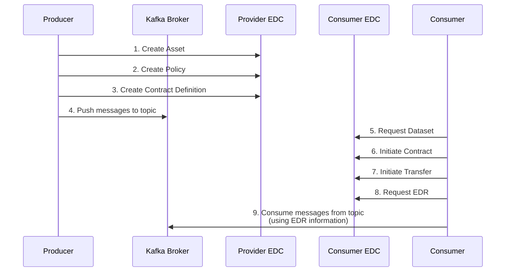

# Kafka Producer and Consumer Applications

## Overview

This directory contains example Kafka producer and consumer applications that demonstrate how to use the Tractus-X EDC
Kafka extension. These applications show how to set up a Kafka-based data exchange between a provider and a consumer
using the Eclipse Dataspace Connector (EDC) as the control plane.

## Building Blocks

### Kafka Producer Application

The Kafka producer application acts as a data provider in the EDC ecosystem. It consists of the following components:

1. **KafkaProducerApp**: The main application class that:
    - Sets up the EDC offer
    - Creates a Kafka producer with OAuth authentication
    - Continuously generates production forecast messages and production tracking messages and sends them to a Kafka topic

2. **EdcSetup**: Responsible for setting up the EDC offer by:
    - Creating an asset that represents the Kafka stream
    - Creating a policy definition that defines access rules
    - Creating a contract definition that combines the asset and policy

3. **Data**: Example values for the Semantic Models [GetProductionForecast](https://github.com/eclipse-tractusx/sldt-semantic-models/blob/main/io.catenax.shopfloor_information.get_production_forecast/1.0.0/gen/GetProductionForecast.json) and [GetProductionTracking](https://github.com/eclipse-tractusx/sldt-semantic-models/blob/main/io.catenax.shopfloor_information.get_production_tracking/1.0.0/gen/GetProductionTracking.json).  
      For each of the semantic models, a dedicated topic is created.

### Kafka Consumer Application

The Kafka consumer application acts as a data consumer in the EDC ecosystem. It consists of the following components:

1. **KafkaConsumerApp**: The main application class that:
    - Fetches EDR (Endpoint Data Reference) data from the EDC
    - Initializes a Kafka consumer with the EDR data
    - Continuously polls for and processes messages from the Kafka topic

2. **DataTransferClient**: Responsible for interacting with the EDC to:
    - Request dataset information from the provider
    - Initiate contract negotiation
    - Wait for contract negotiation to finalize
    - Initiate transfer process
    - Wait for transfer process to start
    - Request the Endpoint Data Reference (EDR)

3. **EDRData**: A data model representing the Endpoint Data Reference, containing:
    - Connection parameters (endpoint, topic, etc.)
    - Authentication details (authKey, authCode, token)
    - Kafka-specific configuration (security protocol, SASL mechanism, bootstrap servers)

4. **EdrTokenCallbackHandler**: Handles OAuth bearer token authentication for Kafka by:
    - Retrieving the OAuth token from the EDR data
    - Parsing the JWT token to extract required claims
    - Creating a token that Kafka can use for authentication

## Runtime Views

### Producer Workflow

1. **EDC Setup Phase**:
    - The producer creates an asset in the EDC that represents the Kafka stream
    - The producer creates a policy definition with access rules
    - The producer creates a contract definition that combines the asset and policy

2. **Data Production Phase**:
    - The producer initializes a Kafka producer with OAuth authentication
    - The producer continuously generates production forecast messages and production tracking messages
    - The producer sends the data to the configured Kafka topic

### Consumer Workflow

1. **Contract Negotiation Phase**:
    - The consumer requests dataset information from the provider
    - The consumer initiates a contract negotiation with the provider
    - The consumer waits for the contract negotiation to finalize

2. **Transfer Process Phase**:
    - The consumer initiates a transfer process using the contract agreement
    - The consumer waits for the transfer process to start
    - The consumer requests the Endpoint Data Reference (EDR)

3. **Data Consumption Phase**:
    - The consumer initializes a Kafka consumer using the EDR data
    - The consumer subscribes to the Kafka topic specified in the EDR
    - The consumer continuously polls for and processes messages from the topic

### Interaction Diagram



## Configuration Options

### Kafka Producer Configuration

The Kafka producer application can be configured using the following environment variables:

| Environment Variable    | Description                               | Default Value                                                     |
|-------------------------|-------------------------------------------|-------------------------------------------------------------------|
| KAFKA_STREAM_TOPIC      | The Kafka topic to produce messages to    | kafka-stream-topic                                                |
| KEYCLOAK_CLIENT_ID      | Client ID for Keycloak authentication     | default                                                           |
| KEYCLOAK_CLIENT_SECRET  | Client secret for Keycloak authentication | mysecret                                                          |
| VAULT_CLIENT_SECRET_KEY | Key for client secret in vault            | secretKey                                                         |
| KEYCLOAK_TOKEN_URL      | URL for obtaining Keycloak tokens         | http://localhost:8080/realms/kafka/protocol/openid-connect/token  |
| KEYCLOAK_REVOKE_URL     | URL for revoking Keycloak tokens          | http://localhost:8080/realms/kafka/protocol/openid-connect/revoke |
| KAFKA_BOOTSTRAP_SERVERS | Kafka bootstrap servers                   | localhost:9092                                                    |
| ASSET_ID                | Identifier for the Kafka stream asset     | kafka-stream-asset                                                |
| EDC_API_AUTH_KEY        | API key for EDC authentication            | password                                                          |
| EDC_MANAGEMENT_URL      | URL for the EDC management API            | http://localhost:8081/management                                  |

### Kafka Consumer Configuration

The Kafka consumer application can be configured using the following environment variables:

| Environment Variable  | Description                              | Default Value                              |
|-----------------------|------------------------------------------|--------------------------------------------|
| ASSET_ID              | Identifier for the Kafka stream asset    | kafka-stream-asset                         |
| PROVIDER_ID           | Provider identifier                      | BPNL00000003AZQP                           |
| PROVIDER_PROTOCOL_URL | URL for the provider's protocol endpoint | http://control-plane-alice:8084/api/v1/dsp |
| EDC_MANAGEMENT_URL    | URL for the EDC management API           | http://localhost:8081/management           |
| EDC_API_KEY           | API key for authentication               | password                                   |

## Usage

### Running the Producer

To run the Kafka producer:

```bash
java -jar kafka-producer.jar
```

### Running the Consumer

To run the Kafka consumer:

```bash
java -jar kafka-consumer.jar
```

### Docker Deployment

Both applications can be deployed using Docker. The Docker Compose file in the parent directory includes configurations
for both applications.

## Security Considerations

Both applications use OAuth Bearer token authentication (SASL/OAUTHBEARER) for secure communication with Kafka. The
producer uses direct OAuth credentials, while the consumer receives its credentials through the EDC's Endpoint Data
Reference (EDR).
