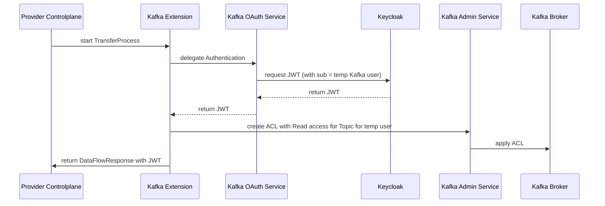
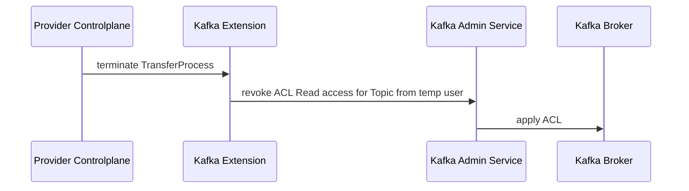

# ADR: Use Hybrid Access Control for Decentralized Kafka Environments

## Context and Problem Statement

In decentralized data-sharing ecosystems such as those built on the Eclipse Dataspace Connector (EDC), secure and scalable access to Kafka brokers must be achieved across organizational boundaries. This includes supporting short-lived, contract-based data exchanges while preserving robust security and traceability.

The challenge is: **How can Kafka enforce fine-grained access control dynamically, based on contract terms, in a secure and auditable way?**

## Decision Drivers

* Need for dynamic, contract-based access control to Kafka topics
* Compatibility with OAuth2-based identities and EDC contract negotiation
* Enforcement of security at both identity and broker levels
* Traceability and audit requirements for compliance

## Considered Options

* OAuth2-based access control only (current implementation)
* Kafka ACLs only
* **Hybrid: OAuth2 authentication + Kafka ACL-based authorization**

## Decision Outcome

**Chosen option**: *Hybrid: OAuth2 authentication + Kafka ACL-based authorization*, because it is the only approach that:

- Supports dynamic access based on EDC-negotiated contracts
- Secures the Kafka broker at a native level (via ACLs)
- Provides auditability through Kafka-native logging mechanisms

### Authentication Flow on Provider Level

The authentication flow illustrates the hybrid security model implementation when a data transfer process begins. 
When the Provider Controlplane starts a transfer, the Kafka Extension coordinates both OAuth2 authentication and Kafka ACL authorization. 
It delegates to the OAuth Service to obtain a JWT token from Keycloak for a temporary Kafka user and creates corresponding ACL permissions for that user to access the specific topic. 
This dual-layer approach ensures that consumers receive both a valid authentication token and that the Kafka broker enforces topic-level access control, providing robust security for contract-based data sharing.

### Termination Flow

The termination flow demonstrates the cleanup process when a data transfer contract ends. 
When the Provider Controlplane initiates transfer termination, the Kafka Extension immediately revokes the temporary user's ACL read permissions for the specific topic through the Kafka Admin Service, which then applies this revocation to the Kafka Broker. 
This ensures that access is promptly removed when the contract-based data sharing arrangement concludes.

### Consequences

* ✅ Good: Enables both dynamic and static enforcement layers
* ✅ Good: Token roles can be mapped to Kafka ACL identities
* ✅ Good: Contract-based access can be honored and monitored
* ⚠️ Bad: May require custom OAuth2-to-ACL mapping logic or plugins
* ⚠️ Bad: Managing hybrid setups may introduce integration complexity

### Confirmation

This ADR will be validated by implementing the integration between EDC and Kafka brokers using ACLs and token-based authentication. Integration nad End-2-End tests will confirm compliance.

## Pros and Cons of the Options

### OAuth2-Based Access Control Only

* ✅ Good: Flexible and works well with contract-based access tokens  
* ✅ Good: Supports interoperability via standard protocols
* ⚪ Neutral: Token introspection and role management are externalized
* ❌ Bad: Kafka does not natively enforce OAuth2 scopes
* ❌ Bad: Risks over-permissiveness if token claims are misused

### Kafka ACLs Only

* ✅ Good: Natively enforced at the broker level
* ✅ Good: ACLs are well-audited and mature
* ⚪ Neutral: Tools exist to manage ACLs programmatically
* ❌ Bad: ACLs are static and not contract-aware
* ❌ Bad: Frequent updates may be required for short-lived permissions

### Hybrid: OAuth2 + Kafka ACLs

* ✅ Good: Tokens reflect dynamic contract context
* ✅ Good: ACLs add a static enforcement layer to limit misuse
* ✅ Good: Token roles can be mapped to Kafka principals
* ✅ Good: Achieves both dynamic enforcement and static guardrails
* ✅ Good: ACL-based access can be revoked instantly during transfer process termination, mitigating the issue of the token validity period
* ⚠️ Bad: Higher integration effort (mapping of OAuth subs to ACLs, creation of ACLs)

## NOTICE

This work is licensed under the [CC-BY-4.0](https://creativecommons.org/licenses/by/4.0/legalcode).  
- SPDX-License-Identifier: CC-BY-4.0  
- SPDX-FileCopyrightText: 2025 Contributors to the Eclipse Foundation  
- Source URL: <https://github.com/eclipse-tractusx/tractusx-edc-kafka-extension>
