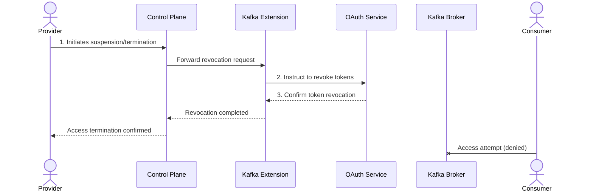

# Secure and Sovereign Data Exchange: Implementing Strategic Requirements with Tractus-X Kafka Extension

## Introduction

This document details the implementation of strategic non-functional requirements related to Security and Data
Sovereignty within the Tractus-X EDC Kafka Extension (referred to as "Kafka Extension" throughout). It explains the
mechanisms, roles, responsibilities, and provides practical examples to ensure robust data security, controlled data
access, and comprehensive data sovereignty.

## 1. Traceable Data Flow

### 1.1 Data Consumption Control

The Kafka Extension offers comprehensive mechanisms for data providers to control data access:

- **Contract Negotiation**: Providers define usage policies via contracts specifying the conditions for accessing Kafka topics.
- **Dynamic Credential Provisioning**: Credentials are dynamically generated upon consumer data transfer requests.
- **Access Control Lists (ACLs)**: OAuth scopes are mapped to Kafka ACLs to grant precise topic access.
- **Token-Based Authorization**: OAuth tokens control Kafka topic access with clearly defined scopes and expiration times.

### 1.2 Access Revocation

The procedure for revoking consumer access includes:

1. **Suspend/Terminate Transfer**: Provider initiates suspension or termination via Control Plane.
2. **Token Revocation**: Kafka Extension instructs OAuth Service to revoke tokens.
3. **Access Termination**: OAuth Service confirmation ceases consumer access.

### 1.3 Component Responsibilities

Explicit responsibilities for data flow control:

- **Control Plane**: Manages negotiations, policy compliance, and interaction with Kafka Extension.
- **Kafka Extension**: Coordinates credential management between Control and Data Planes.
- **OAuth Service**: Handles dynamic client registrations, token lifecycle management.
- **Vault**: Securely stores authentication credentials and secrets.

## 2. Token Management

### 2.1 Token Roles

Tokens utilized by the Kafka extension:

- **Access Tokens**: Short-lived JWT tokens facilitating immediate Kafka topic access.

### 2.2 Token Lifecycle

Scenarios managed by token lifecycle processes:

- **Normal Expiration**: Automated token refresh prior to expiration.
- **Forced Revocation**: Immediate token revocation capability.
- **Failed Refresh**: Consumer access revoked upon termination of EDC Transfer Process or Contract Negotiation by the provider.
  The Consumer will be notified by the transfer or contract terminated message. 
  After token expiration, the Consumer will receive an unauthorized error when trying to connect.

### 2.3 Asset Role

- The **Kafka topic** is the negotiated asset, not individual records.
- Topic-level negotiation and access control.
- Consumers access all messages published during token validity.

## 3. Security Measures

### 3.1 Security Protocols

Kafka Extension security protocols include:

- **Transport Encryption**: Secure communications using TLS/SSL (SASL_SSL protocol).
- **Authentication**: OAuth 2.0 tokens via [SASL/OAUTHBEARER](https://kafka.apache.org/documentation/#security_sasl_oauthbearer).
- **Authorization**: Comprehensive authorization via EDC policies, Kafka ACLs, and OAuth scopes.

### 3.2 Protection Against Unauthorized Access

Security features preventing unauthorized access:

- **Dynamic Credential Management**:
  A unique, temporary access token is generated for each new transfer process.
  The consumer can initiate additional transfer processes at any time, provided the underlying contract remains active and valid.
- **Short-lived Tokens**: Reducing potential misuse windows.
- **Secure Storage**: Credentials managed securely in Vault.
- **Token Validation**: OAuth Service token validation prior to Kafka access.

## 4. Self-Sovereign Data Sharing

### 4.1 Autonomous Control

Providers maintain full autonomous control over data sharing:

- **Policy Definition**: Customizable data access policies.
- **Dynamic Management**: Real-time policy enforcement via Control Plane.
- **Data Residency**: Data remains on provider infrastructure, access-only model.
- **Contractual Governance**: Data access managed through explicitly negotiated contracts that empower data providers to
  define their own interaction terms, enhancing sovereignty.

### 4.2 Granular Access Control

Fine-grained access capabilities provided by the Kafka Extension include:

- Controlled visibility of contract offers.
- Varied policy applications to assets.
- Topic-policy mapping with precise constraints.

### 4.3 Data Sovereignty Scenarios

Illustrative scenarios demonstrating data sovereignty:

1. **Time-Limited Access:**  
   Defined duration access, automatically terminated post-expiration.

2. **Purpose-Specific Access:**  
   Explicit use-case limitations such as quality assurance only.

3. **Selective Revocation:**  
   Immediate revocation for misuse incidents without wider service impact.

4. **Auditability:**  
   Complete records of contract negotiations and transfer processes are persisted in the EDC and allow compliance
   verification.

5. **Differentiated Access Levels:**  
   Persistent policies for long-term customers. Short-term revocable policies for consultants and auditors.

## Conclusion

The Kafka Extension integrates robust security measures and comprehensive data sovereignty controls, enabling data
providers to securely manage and share real-time data while maintaining full governance over their assets.

## Glossary

- **EDC**: Eclipse Dataspace Connector
- **ACL**: Access Control List
- **JWT**: JSON Web Token
- **SASL**: Simple Authentication and Security Layer
- **TLS**: Transport Layer Security

## More information

- **Control Plane**: https://eclipse-edc.github.io/documentation/for-adopters/control-plane/
- **Data Plane**: https://eclipse-edc.github.io/documentation/for-adopters/data-plane/
- **Vault**: https://eclipse-edc.github.io/documentation/for-adopters/extensions/#secrets-handling-and-the-vault
- **OAuth Scopes**: https://oauth.net/2/scope/
- **Kafka Topic**: https://kafka.apache.org/intro#intro_concepts_and_terms
