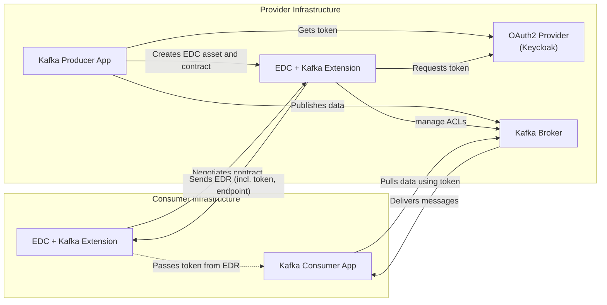
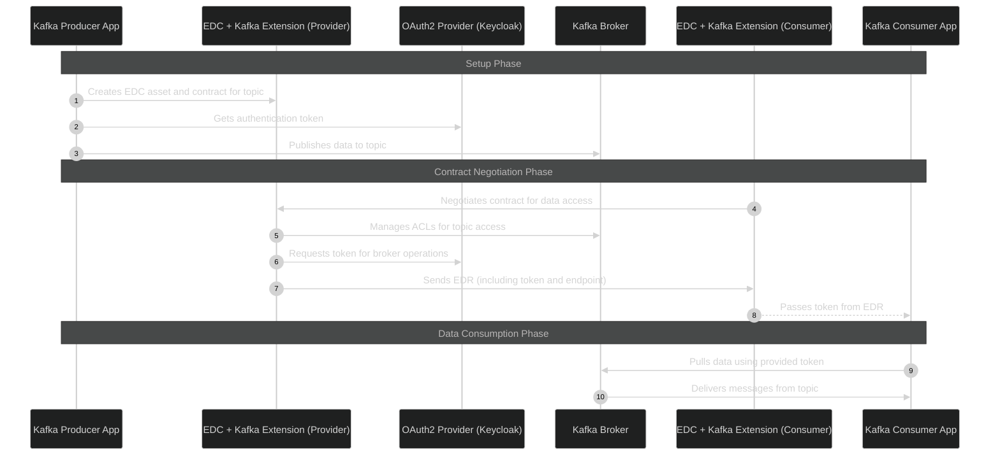

# Solution Design – Tractus-X EDC Extension: Kafka Pull (TRL 3 → TRL 7)

## 1. Business Case

The Tractus-X EDC Kafka Extension enables policy-based, event-driven data exchange between sovereign partners via Apache Kafka. 
Advancing the current proof-of-concept (TRL 3) to TRL 7 will demonstrate a secure, interoperable, and end-to-end streaming data plane component for Tractus-X.

## 2. Requirements Analysis

### 2.1 Goals & Deliverables

#### 2.1.1 Solution Concept

- Design a robust architecture for the Kafka-based Streaming Data Plane
- Plan phased evolution from experimental prototype (TRL 3) to operational system (TRL 7)

#### 2.1.2 Implementation

- Develop a functional Kafka-based Data Plane extension
- Integrate with Eclipse Dataspace Connector (EDC)
- Ensure compliance with Tractus-X Release Guidelines (TRGs) for R25.12
- Conduct integration testing and document system behavior
- Provide technical documentation for configuration, installation, and operation

#### 2.1.3 EDC Streaming E2E Test

- Identify and specify relevant user journeys (e.g., asset publishing, contract negotiation)
- Derive and define test cases from the user journeys
- Implement automated E2E tests based on the existing CI/CD pipeline
- Set up the test environment using HELM charts (EDC, Kafka, Keycloak)
- Execute and document test runs (logs, validation results)
- Integrate testing into the automated pipeline and provide support for error analysis

#### 2.1.4 Development of a Use Case Demonstrator

- Implement a demonstrator with a local deployment showcasing a realistic use case
- Provide HELM charts for quick, consistent deployment
- Integrate test data to visualize streaming asset exchange
- Document configuration steps and commissioning procedures

### 2.2 Premises

- Apache Kafka serves as the streaming backbone
- Kubernetes is the target runtime (K3s, Kind, or cloud-native)
- CI/CD managed via GitHub Actions
- Open-source (Apache 2.0) with SPDX-compliant dependencies
- Alignment with Eclipse Tractus-X and Catena-X

### 2.3 Requirements Catalog

#### Functional

- Stream messages over Kafka based on policy-negotiated contracts as part of the EDC

#### Non-Functional

- Observability: metrics, logging
- Secure identity and access control using OAuth2, Kafka ACLs, and SSL
- Configurable deployment with HELM

#### Compliance

- Full alignment with Tractus-X Release Guidelines (R25.12)
- SPDX headers and license documentation
- Conformance to Data Space Protocol (DSP) specifications

## 3. Current Situation

### 3.1 Process

#### 3.1.1 Identified User Journeys

- Provider creates EDC asset for a topic → publishes messages to the topic
- Consumer negotiates contract offer for a topic → subscribes to the topic → message delivery

#### 3.1.2 Current System Capabilities

- Functional PoC exists with basic Kafka-to-EDC integration
- No Helm charts or Kubernetes-native configuration
- Missing error handling and observability
- Manual testing; lacks integration and end-to-end test automation and deployment reproducibility

### 3.2 Data

#### 3.2.1 Message Model Overview

- Kafka topics used for streaming messages
- JSON payloads exchanged without schema enforcement

#### 3.2.2 State Management

- Data exchange lifecycle follows the EDC state machine
- Status: `ContractNegotiation.REQUESTED`, `ContractNegotiation.FINALIZED`, `TransferProcess.REQUESTED`, `TransferProcess.STARTED`

#### 3.2.3 Protection & Risk

- Current setup lacks topic-level access control
- OAuth role mappings and token validation are not tested
- Kafka traffic is not encrypted (switch from SASL_PLAINTEXT to SASL_SSL)

### 3.3 System

#### 3.3.1 Context View

System diagram includes:

- EDC Core + Extension
- Kafka Broker
- OAuth2 Provider (Keycloak)
- Kafka Producer/Consumer apps



#### 3.3.2 Runtime View



1. **Asset Creation**: The producer registers the Kafka topic as a data asset in the EDC, creating a contract offer for potential consumers
2. **Producer Authentication**: The producer obtains an OAuth2 token from Keycloak for authenticating with the kafka broker
3. **Data Publishing**: The producer application publishes business data to a Kafka topic that will be shared as a data asset
4. **Contract Negotiation**: The consumer's EDC initiates contract negotiation with the provider to gain access to the desired data asset
5. **ACL Management**: The provider's EDC extension configures Kafka Access Control Lists (ACLs) to manage who can access the topic
6. **Provider Token Request**: The EDC provider requests authentication tokens from Keycloak for managing broker operations
7. **EDR Delivery**: Upon successful negotiation, the provider sends an Endpoint Data Reference (EDR) containing access credentials and endpoint information
8. **Token Passing**: The consumer EDC passes the authentication token from the EDR to the consumer application
9. **Data Access**: The consumer application uses the provided token to authenticate and pull data directly from the Kafka broker
10. **Message Delivery**: Kafka delivers the requested messages from the topic to the authenticated consumer

#### 3.3.3 Interfaces

- REST APIs (EDC, OAuth2 Token)
- Kafka topics with custom messages
- DataAddress definitions for Kafka endpoints

## 4. Target Architecture

### 4.1 High-Level Architecture

#### 4.1.1 System Landscape

- Full deployment on Kubernetes using Helm
- Modular EDC Extension with isolated Kafka communication logic
- Kafka Broker running on Kubernetes

##### Kafka on Kubernetes: Strimzi vs Bitnami Helm Chart

See ADR [adr-kafka-on-kubernetes.md](../adr/adr-kafka-on-kubernetes.md)

#### 4.1.2 Component Breakdown

The Kafka Extension consists of the following key components:

- **Kafka Broker Extension**: Core Control Plane extension that implements the `DataFlowController` interface to handle the "Kafka-PULL" transfer type. It manages the following operations:
  - Creating OAuth2 credentials and tokens for secure access to Kafka topics
  - Building Endpoint Data References (EDRs) for consumers
  - Revoking tokens and cleaning up credentials when transfers are suspended or terminated
  - Integrating with the EDC Vault for secure credential storage

- **Data Address Kafka**: Defines the data address format for Kafka assets, including:
  - Topic configuration
  - Bootstrap server settings
  - Security protocol and SASL mechanism
  - OAuth2 token configuration
  - Consumer group settings

- **Validator Data Address Kafka**: Validates Kafka data addresses to ensure they contain all required properties and have valid values.

- **OAuth Service**: Manages authentication and authorization for Kafka access:
  - Integrates with OAuth2 providers (e.g., Keycloak)
  - Handles token issuance, renewal, and revocation
  - Supports secure token-based access to Kafka topics

- **Monitoring Integration**: Provides observability through:
  - Metrics via Micrometer for performance monitoring
  - Logging via EDC Logging for troubleshooting
  - Integration with OpenTelemetry and Jaeger for visualization (https://github.com/eclipse-edc/Samples/tree/main/advanced/advanced-01-open-telemetry)

### 4.2 Technical Architecture

#### 4.2.1 Data Flow Design

- **Kafka Topics as Data Assets**: Kafka topics represent actual business data assets that can be shared between participants in a data space
- **Semantic Data Models**: Topics contain domain-specific business data in the form of semantic models that provide value to participants
- **Asset Registration**: Providers register Kafka topics containing valuable business data as assets in the EDC
- **Contract-Based Access**: Consumers gain access to these topic-based assets through the standard EDC contract negotiation process
- **Secure Data Exchange**: Upon successful contract negotiation, consumers receive secure access credentials (OAuth tokens) to consume data from the specific Kafka topics
- **Data Flow Traceability**: All data exchanges are tracked in the EDC with metadata including contractId, assetId, and timestamps to ensure auditability and compliance ℹ️ TBD how much of this is actually audited in the EDC

#### 4.2.2 Interface & Schema Definitions

- Extend `TransferStartMessage` to include `endpointProperties`
  - the EDC handles this internally. EDC management API does not return DataAddresses in the DSP Protocol form
- `DataAddress` must define Kafka broker URL via `endpoint` property
- Reference: [DSP 10.2.3 Transfer Start Endpoint](https://eclipse-dataspace-protocol-base.github.io/DataspaceProtocol/2025-1-RC1/#transfers-providerpid-start-post)

#### 4.2.3 Fault Tolerance

- Retry/backoff mechanism for failed transfers
- Support for idempotent processing (safely retry operations without unintended side effects)
- Chaos tests for Kafka and Keycloak failure scenarios
  - see chapter [6.1.4 Chaos & Load Testing](#614-chaos-testing)

#### 4.2.4 Observability

- Metrics via [Micrometer](https://eclipse-edc.github.io/documentation/for-contributors/metrics/)
- Logs via [EDC Logging](https://eclipse-edc.github.io/documentation/for-contributors/logging/)

### 4.3 Security Architecture

- Switch Kafka Security Mechanism from SASL_PLAINTEXT to SASL_SSL
- JWT/OAuth validation integrated into the Kafka flow
- Kafka topic ACLs bound to OAuth roles
- Enhanced test coverage for role-based access

#### SASL_SSL

The EDC Kafka Extension allows consumption of Topics over company borders. To allow secure transfer of data, the usage of end-to-end encryption is crucial. 
Hence, we need to switch from the security protocol from SASL_PLAINTEXT to SASL_SSL.

To achieve this on the client side, we simply replace the property. This way, all public CA-signed certificates are accepted.
We also want to allow flexibility, so it should be possible to configure the consumer client to use a custom certificate.

On the provider side, this requires more setup.
To sign and encrypt the traffic, the Broker needs to use an SSL Certificate. To not require additional exchange of trusted certificates, the Broker has to use a public CA-signed certificate. 

#### Token expiry

The current implementation uses the OAuth2 client_credentials Authentication flow. This is the recommended approach for machine-to-machine communication.
There is the downside that a token cannot be revoked once it has been issued.  
The consequence is that the provider cannot revoke access to a created Transfer process immediately. The token will always be valid for the remaining Token Expiry period.  
Subsequent transfer processes, however, will be denied afterward.
To limit the risk of unauthorized access to topics, the default Token TTL is set to 5 minutes.

It is technically possible to verify if a token was revoked, but this requires a custom LoginCallbackHandler, which is only possible by building a custom Docker image for the Kafka Broker. This is not recommended.

**Question: Do we want to allow a configurable Token Expiry – either via EDC configuration or via the Asset?**
This way, the provider can choose how long a token will be valid with the potential of a higher load on the identity provider due to more token issuance

#### Hybrid use of Kafka ACLs and OAuth2 roles

See ADR [adr-hybrid-oauth2-kafka-acl-security.md](../adr/adr-hybrid-oauth2-kafka-acl-security.md)

## 5. Implementation & Deployment

### 5.1 DevOps & CI/CD

#### 5.1.1 Tooling Stack

- GitHub Actions for building, testing, and image publishing
- Docker Registry
- Helm for reproducible stack provisioning

#### 5.1.2 Pipeline Enhancements

- Integrate unit, integration, and E2E test stages
- Add software composition analysis and dependency checks
- Auto-publish Helm charts and Docker images
- Publish the package for the EDC extension to maven central
  - use tractus-x EDC repo as a template on how to publish maven packages

### 5.2 Guidelines

- Maintain changelog and ADRs
- Follow semantic versioning
- Align codebase with Tractus-X linting and release conventions

## 6. Testing & TRL Validation

### 6.1 Testing Strategy

A comprehensive testing strategy is essential for advancing the Tractus-X EDC Kafka Extension from TRL 3 to TRL 7. 
This strategy ensures that all components work correctly individually and together, security measures are properly implemented, and the system behaves as expected under various conditions. 
The testing approach is designed to validate both functional and non-functional requirements, with a particular focus on the security, reliability, and interoperability aspects critical for data space implementations.

#### 6.1.1 Unit Testing

Unit testing forms the foundation of our testing pyramid, focusing on validating individual components in isolation:

- Expand unit test coverage in EDC Kafka extension to achieve >80% code coverage
- Implement comprehensive test suites for all core components:
  - Kafka Broker Extension
  - Data Address Kafka
  - Validator Data Address Kafka
  - OAuth Service
- Add edge cases and improve assertions to ensure robustness:
  - Invalid configurations
  - Malformed data addresses
  - Token validation failures
  - Error handling scenarios
- Introduce unit tests in the use case demonstrator apps to validate business logic
- Implement mocking strategies for external dependencies (Kafka, OAuth providers)
- Use JUnit 5 and Mockito for test implementation

#### 6.1.2 Integration Testing

Integration testing validates the interaction between components and with external systems:

- Implement Testcontainers-based integration setup simulating real Kafka interaction
  - Use Bitnami Kafka container to match production deployment
  - Configure with SASL_SSL security protocol to validate encryption
- Set up EDC-like Testcontainer orchestration for full message flow simulation following [EDC integration testing guidelines](https://eclipse-edc.github.io/documentation/for-contributors/testing/#4-integration-tests)
- Focus on resilience and failure handling:
  - Connection failures
  - Timeout scenarios
  - Retry mechanisms
  - Error propagation
- Test the hybrid OAuth2 + Kafka ACL security model:
  - Validate that OAuth2 tokens are correctly generated and validated
  - Verify that Kafka ACLs are properly created and enforced
  - Test the authentication flow on provider level
  - Test the termination flow for revoking access
- Implement integration tests for token refresh mechanisms
- Validate correct behavior when token expiry occurs during active transfers

#### 6.1.3 End-to-End Testing

End-to-end testing validates the complete system behavior in a production-like environment:

- Implement Helm-based E2E tests in Kubernetes using the Bitnami Kafka Helm chart
- Set up automated test environments with all components:
  - EDC with Kafka extension
  - Kafka broker with SASL_SSL security
  - Keycloak for OAuth2 authentication
  - Producer and consumer applications
- Validate complete asset negotiation and transfer via Kafka
- Target: Participation in R25.12 E2E Testing Phase with fully automated test suite

##### Test Cases

###### Good Cases

- Provider creates an asset → provider publishes a message → consumer negotiates the topic → consumer consumes a message
- Provider creates an asset → provider publishes a message → consumer negotiates the topic → consumer consumes a message → consumer consumes until token expiry → consumer refreshes the transfer process → consumer continues to consume messages

###### Bad Cases

- Provider creates an asset → provider publishes a faulty message → consumer negotiates the topic → consumer displays the correct error
- Provider creates asset → provider publishes a message → consumer negotiates the topic → negotiation fails → consumer cannot access the topic
- Provider creates asset → provider publishes a message → consumer negotiates the topic → provider terminates contract → consumer tries to consume a message → consumption fails due to revoked ACLs
- Provider creates asset → provider publishes a message → consumer negotiates the topic → consumer tries to access a different topic with token → access is denied by Kafka ACLs
- Provider creates asset → consumer negotiates successfully → token expires → consumer attempts to use expired token → access is denied

###### Security-Specific Cases

- Test the complete authentication flow as described in the hybrid OAuth2 + Kafka ACL security model
- Validate that ACLs are correctly created when a transfer process starts
- Verify that ACLs are properly revoked when a transfer process is terminated
- Test that a consumer cannot access topics after contract termination, even with a valid token
- Verify that token refresh works correctly and new tokens maintain the same access permissions

#### 6.1.4 Chaos Testing

Chaos and load testing validate system behavior under stress and failure conditions:

- Implement chaos testing  in Kubernetes
- Simulate outages for critical components:
  - Keycloak unavailable during token refresh
  - Kafka Broker unavailable during message consumption

#### 6.1.5 Test Data Management

Effective test data management ensures reproducible and meaningful tests:

- Evaluate existing test data quality and identify gaps
- Use pseudo-randomly generated semantic assets (e.g. [GetProductionForecast](https://github.com/eclipse-tractusx/sldt-semantic-models/blob/main/io.catenax.shopfloor_information.get_production_forecast/1.0.0/gen/GetProductionForecast.json) and [GetProductionTracking](https://github.com/eclipse-tractusx/sldt-semantic-models/blob/main/io.catenax.shopfloor_information.get_production_tracking/1.0.0/gen/GetProductionTracking.json))
- Define reproducible datasets for regression testing

### 6.2 TRL Roadmap

| TRL | Objective                              | Milestone                                   |
|-----|----------------------------------------|---------------------------------------------|
| 3   | Prototype runs locally                 | Manual testable PoC                         |
| 4   | Interfaces work in containerized tests | Integration with Kafka validated            |
| 5   | E2E flow completed                     | Negotiation + message delivery automated    |
| 6   | Kubernetes deployment                  | CI/CD pipeline, secured components          |
| 7   | Demonstrator with full coverage        | Tractus-X compliant, observable, and tested |

## 7. Demonstrator & Use Case

### 7.1 Demonstrator Architecture

- Clean, focused use-case with business relevance
- Docker images have to be published for use in the Helm Charts
- (Optional) Refactor the implementation as Spring Boot microservices (Kafka Producer & Consumer) for easier containerization.

### 7.2 Helm Deployment

#### Helm Chart structure

```
charts/
 ├─ tractusx-edc-kafka/  # tractusx-edc with the kafka controlplane runtime image
 ├─ consumer-app/        # simple helm chart for the kafka consumer 
 ├─ producer-app/        # simple helm chart for the kafka producer 
 └─ edc-kafka-demo/      # umbrella chart for testing
     Chart.yaml          # declares deps: edc-kafka-extension, kafka, keycloak, consumer-app, producer-app
```

Only the `tractusx-edc-kafka` Chart will be published as Helm Chart. 
The other charts are only intended for testing.

Docker images are published for the edc-kafka-extension, consumer-app, and producer-app.

### 7.3 Documentation

- Solution design and demonstrator architecture in Markdown
- Setup instructions and commissioning guide
- EDC extension configuration examples

## 8. Documentation & Compliance

### 8.1 Open Source Compliance

- SPDX headers in all source files
- Apache 2.0 license for Code included
- CC-BY-4.0 license for non-Code included
- 3rd-party dependency tracking (SBOM)

### 8.2 Conformance to Tractus-X Standards

- Aligned with EDC conformance profiles
- Tractus-X Release Guidelines (R25.12) satisfied
- Kafka Data Transfer Profile to be added (send to Arno Weiss)
  See: [DSP Data Transfer Profiles](https://github.com/eclipse-dataspace-protocol-base/dsp_best_practices/tree/main/profiling/data-transfer-profiles)

### 8.3 Documentation Assets

- Architecture Decision Records (ADRs)
- API documentation (OpenAPI, JSON schema)
- Testing and release documentation

## 9. Project Management

### 9.1 Stakeholder Analysis

- **Tractus-X Release Coordinators** - Responsible for R25.12 compliance and release integration
- **Lars Geyer-Blaumeiser** - Tractus-X EDC Lead, TAP7.8 Lead
  - Key decision maker for EDC architectural alignment
  - Point of contact for TAP7.2 "Monitoring and Logging"
- **Arno Weiss** - DSP Transfer Profiles reviewer
  - Responsible for reviewing and approving the Kafka Data Transfer Profile
 **Thomas Henn** - Dataspace concepts advisor
  - Provides guidance on compatibility between push-based messaging patterns and dataspace need-to-know principles
  - Critical for ensuring architectural decisions align with broader dataspace concepts

### 9.2 Open Items List and Decision Log

- **Schema Registry**: We do not need a schema registry, since this is part of the provider infrastructure and not of the kafka extension. The test data used is based on the already standardized semantic models.
- **Token Expiry Configuration**: We do not need to allow customizable token expiry. The default of 5 minutes is sufficient.
- **Kafka ACLs tied to OAuth roles**: Yes, we want to use this approach. If it gets too complex to implement this solution, we need to discuss this further.
- **Fault tolerance with retries, DLQs, and back-pressure support**: Not relevant for this project. We only need to make sure that the implementation of the EDC extension is resilient towards OAuth2 and Kafka broker failures. The consumer/provider applications are responsible for their own fault tolerance implementation as needed.
- **Publishing consumer/provider apps**: We need to publish the apps as docker images since we need them for the test setup, and without published docker images, automated testing is not possible. However, for the release only the EDC extension is relevant as the primary deliverable.
- **Extension release strategy**: We keep it in this repository for now. The general process of how to publish extensions has to be clarified on a general level first. There were some discussions with different opinions on this matter in the past that are not yet resolved.
- **OAuth flow requirements**: There were some more requirements regarding the OAuth flow. We need to address these concerns and evaluate what the better solution is. We take this discussion to the EDC weekly Tuesdays. We need to find a good middle ground between usability/acceptance and theoretical correctness. The solution has to be good enough to be accepted by the EDC team.

### 9.3 Risk List

- Compatibility with evolving Tractus-X release guidelines (R25.12)

## NOTICE

This work is licensed under the [CC-BY-4.0](https://creativecommons.org/licenses/by/4.0/legalcode).

* SPDX-License-Identifier: CC-BY-4.0
* SPDX-FileCopyrightText: 2025 Contributors to the Eclipse Foundation
* Source URL: <https://github.com/eclipse-tractusx/tractusx-edc-kafka-extension>
